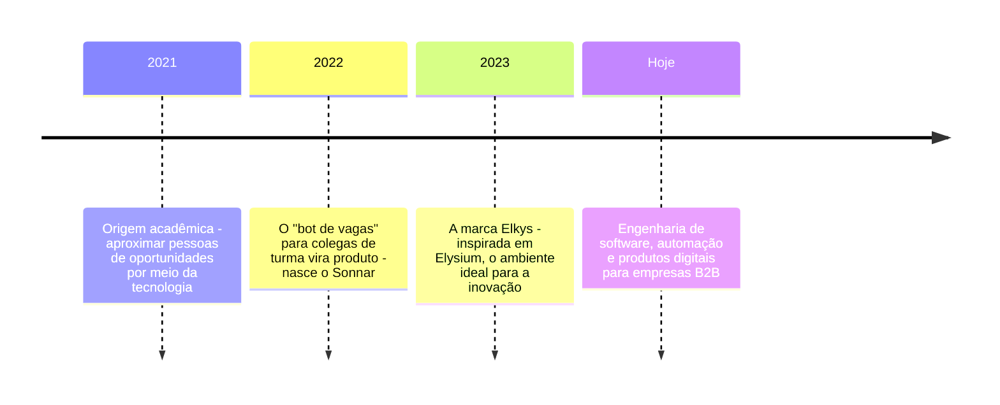
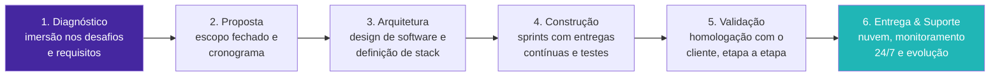

# e\kys.

**Engenharia de software sob demanda com processo, qualidade e previsibilidade.**

---

## Quem somos

Ajudamos empresas B2B a superarem os limites de sistemas genéricos. Software
pronto impõe processos engessados; nós criamos ecossistemas digitais
alinhados à exata realidade operacional de cada negócio - com arquitetura
escalonável, comunicação direta com quem desenvolve (sem intermediários) e
entrega previsível, etapa por etapa.

> **Engenharia de software não é apenas sobre escrever código, mas sobre
> criar soluções sustentáveis que impulsionam o crescimento e a eficiência
> dos negócios.** - Manifesto Elkys

## Nossa história

## O que fazemos

| | |
|---|---|
| 🛠️ **Dev sob demanda** | Sistemas web e mobile sob medida, com arquitetura definida para performance, segurança e manutenibilidade. |
| ⚙️ **Automação & RPA** | Redução de erros manuais e ganho de eficiência com robôs inteligentes e fluxos auditáveis. |
| 🔗 **Integração de APIs** | Seus sistemas conversando entre si, com dados consistentes de ponta a ponta. |
| 🧭 **DevOps & Cloud** | Diagnóstico, arquitetura e esteiras de entrega para operações que precisam escalar. |

### Produtos próprios (SaaS powered by Elkys)

| | |
|---|---|
| **Sonnar** | Busca inteligente de vagas 24/7 - monitora oportunidades, otimiza currículos e analisa compatibilidade técnica. |
| **Dashy** | Gestão financeira para espaços de beleza e bem-estar - agendamento, equipe e avisos automáticos aos clientes. |

## Como trabalhamos - Hexa Design System

O **HDS** estrutura cada projeto em **6 etapas** com escopo fechado,
entregáveis documentados e validação obrigatória entre etapas:

O resultado: previsibilidade de prazo, controle de escopo e rastreabilidade
de ponta a ponta - do primeiro diagnóstico à sustentação em produção.

## Nossos números

| **20+** | **98%** | **2+** | **≤ 2h úteis** |
|:---:|:---:|:---:|:---:|
| Projetos em produção | Retenção de clientes | Anos de operação | Resposta técnica inicial |

## Nossos valores

**Transformação com propósito** - cada tecnologia deve provocar melhoria
tangível e mensurável no negócio. · **Simplicidade e praticidade** -
tecnologia deve descomplicar. · **Inovação aplicada** - sem respostas
padrão para desafios específicos. · **Proximidade e parceria** - imergimos
no contexto do cliente. · **Compromisso com resultados** - nos
responsabilizamos pelo impacto do que entregamos. · **Ética e
transparência** - relações pautadas em clareza e evolução contínua.

## Stack

Todo repositório da organização segue o mesmo git-flow protegido por
rulesets (`protect-dev`/`protect-main`/`protect-release`), com validação de
segurança em cada PR (SAST, segredos, CVEs, Trivy) centralizada no
[`ci-templates`](https://github.com/ElkysOfficial/ci-templates).

---

**Seu processo é único. Seu software também deveria ser.**

📫 [contato@elkys.com.br](mailto:contato@elkys.com.br) · [elkys.com.br](https://elkys.com.br) · Belo Horizonte, MG - Brasil

